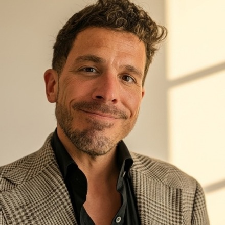

<h1>Mac Anderson - Founder & CEO of <a href="https://oxagen.sh">Oxagen</a></h1>

Building the infrastructure layer for AI agents. From Los Angeles, CA.

  
  

  
  

---

I am a founder who still writes the code. I have been on GitHub since 2010, and I ship code every day. My focus is Oxagen and we aim to be the go to agent platform for ultra-secure, compliance heavy organizations and state/local/federal governments.

## What I build

I am the founder and CEO of **[Oxagen](https://oxagen.sh)**, and I am also the principle engineer and architect. Three things I created and actively build:

- **Oxagen Platform** &nbsp;·&nbsp; the metered, governed, graph-grounded control plane for teams that build and resell AI agents. This is the core product. The repo is private, but it is mine end to end: the architecture, the capability contracts, the knowledge graph, and most of the commits. Site: **[oxagen.sh](https://oxagen.sh)**.
- **[Stella](https://github.com/oxageninc/stella)** &nbsp;·&nbsp; a fast, BYOK, model-agnostic terminal coding agent, in Rust. Parallel tools, judged goals, and witness-verified "done". I created it and maintain it.
- **[Arena](https://github.com/oxageninc/arena)** &nbsp;·&nbsp; run your coding agent head to head against Claude Code, Gemini, and other top agents, with regression checks that keep it improving instead of drifting. Also mine.

## More open source

- **[confetti](https://github.com/macanderson/confetti)** &nbsp;·&nbsp; manage environments, variables, and secrets from many sources with ease. `Python`
- **[ml-notebooks](https://github.com/macanderson/ml-notebooks)** &nbsp;·&nbsp; language-model exploration notebooks. `Jupyter`
- **[dotfiles](https://github.com/macanderson/dotfiles)** &nbsp;·&nbsp; my machine setup and installer scripts. `Shell`

## On GitHub, every day

The numbers below are on my public profile, so you can check the graph yourself.

**The stack I build in:**

  
  
  
  
  
  
  
  

## Let's talk business

I read every message, and I move fast. If you want to talk about working together, investing, partnering, or building on Oxagen, the quickest way to reach me is my phone. Text or call.

- Email: **[mac@oxagen.sh](mailto:mac@oxagen.sh)**
- Phone: +1-628-236-7797
- Website: **[macanderson.com](https://macanderson.com)**
- Company: **[oxagen.sh](https://oxagen.sh)** &nbsp;·&nbsp; Los Angeles, CA
